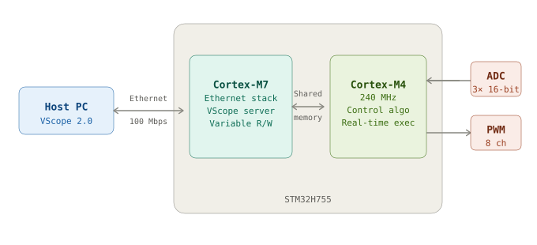
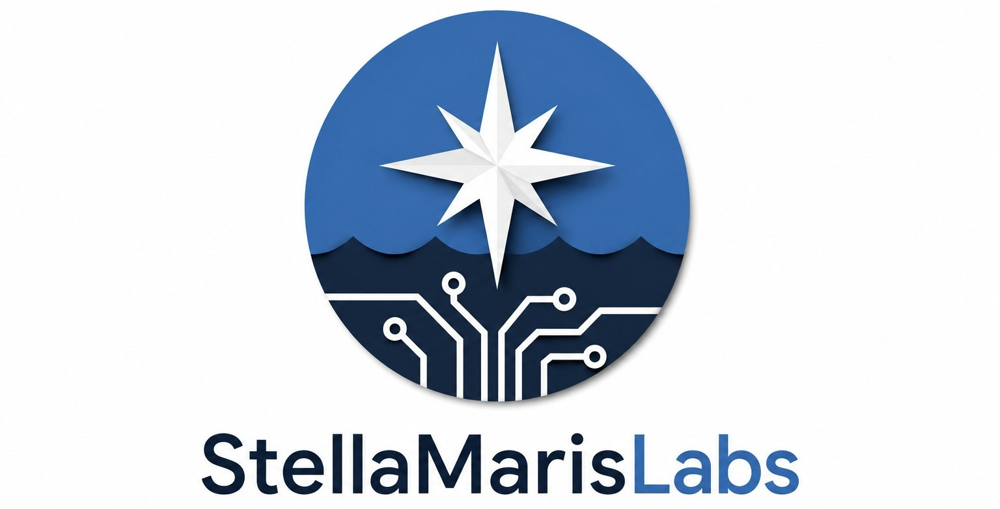

# V-SoM — Versatile System-on-Module for Power Electronics Debug & Control

<p align="center">
  
  &nbsp;&nbsp;
  
</p>

<p align="center">
  
  
  
  
  
</p>

<p align="center">
  <b>Develop. Deploy. Debug. Scale.</b><br/>
  A compact, production-ready embedded control module for power electronics, motor drives and custom control applications.
</p>

---

## Overview

Developing a custom power electronics controller typically requires:

- Designing dedicated control hardware from scratch
- Implementing communication interfaces and telemetry
- Integrating simulation environments with embedded targets
- Building software infrastructure before writing a single line of control code

**V-SoM eliminates this overhead.**

Built around the **STM32H755 dual-core microcontroller**, V-SoM combines high-performance real-time control, rapid prototyping workflows and integrated data acquisition into a single embeddable module[...]

---

## Key Features

| Feature | Specification |
|---|---|
| **MCU** | STM32H755 — Dual Core (Cortex-M7 + Cortex-M4) |
| **Control Core** | Cortex-M4 @ 240 MHz |
| **Communication Core** | Cortex-M7 |
| **PWM Outputs** | 5× HRTIM + 3× Advanced Timer complementary channels |
| **ADCs** | 3× 16-bit, up to 3.6 MSPS |
| **Analog Inputs** | 14 |
| **Ethernet** | 100 Mbps (integrated PHY + RJ45 with magnetics) |
| **Other Interfaces** | CAN, SPI, I²C |
| **GPIO** | 56 configurable pins |
| **Data Streaming** | Up to 60 channels @ 50 kSPS |
| **Form Factor** | 45 mm × 52 mm, 6-layer PCB, castellated edges |
| **Supply Voltage** | 3.3 V – 5.5 V |

---

## Architecture



| Core | Role |
|---|---|
| **Cortex-M7** | Ethernet communication, VScope server, variable read/write |
| **Cortex-M4** | User control algorithm, ADC sampling, PWM generation — fully dedicated |

This architecture guarantees **deterministic real-time execution** on the M4 while the M7 handles all telemetry and configuration transparently over Ethernet.

---

## VScope 2.0 — Integrated Real-Time Oscilloscope

One of the key features of V-SoM is **VScope 2.0**, an integrated virtual oscilloscope for real-time monitoring, editing and logging of variables running directly on the target.


### Capabilities

| Capability | Detail |
|---|---|
| Channels | Up to **60** simultaneous |
| Sample Rate | Up to **50 kSPS** streaming |
| Live Editing | Modify variables at runtime |
| Acquisition | Oscilloscope-style triggering |
| Export | CSV |
| Post-processing | Supported |

Observable signals include measured variables, internal controller states, setpoints, duty cycles, protection thresholds and diagnostic data — without affecting real-time execution performance.

Communication runs over Ethernet, enabling **remote monitoring and debugging** with no additional instrumentation.


### Live Demonstration

<video src="H755.mp4" width="640" height="480" controls>
  Your browser does not support the video tag.
</video>

*STM32H755 V-SoM real-time VScope demonstration — live variable monitoring and signal streaming.*

---

## Development Workflow

<!--  -->

### 1 · Design

Develop and validate your controller in simulation:

- [PLECS](https://www.plexim.com/)
- [Simulink](https://www.mathworks.com/products/simulink.html) / Simscape
- Custom C

### 2 · Deploy

Generate embedded code or write firmware directly, then flash the target:

```bash
# Example: drag-and-drop via ST-Link (Cortex-M7 communication firmware)
# User control code runs on Cortex-M4 via your preferred toolchain
```

**Supported environments:**

| Toolchain | Target Core |
|---|---|
| Simulink Embedded Coder | Cortex-M4 |
| PLECS Coder | Cortex-M4 |
| STM32CubeIDE | Both |
| VS Code | Both |
| Bare-metal C | Both |

### 3 · Validate

Monitor all signals live with VScope 2.0 over Ethernet. Edit setpoints and parameters at runtime without stopping execution.

### 4 · Scale

Migrate the validated algorithm to a target production platform:

- STM32F4 / STM32G4 / STM32L4

or continue using V-SoM directly in **low and medium volume products**.

---

## Competitive Comparison

| Metric | V-SoM | STM32 G4 | B-Board | RTBoxCE | dSpace |
|---|:---:|:---:|:---:|:---:|:---:|
| **Cost** | 🟡 $$ | 🟢 **$** | 🔴 $$$$ | 🔴 $$$$$ | 🔴 $$$$$ |
| **Remote Control & Software** | 🟢 **VScope2.0**<br>Open Source | ⚪ NA | 🔴 Proprietary | 🔴 Proprietary | 🔴 Proprietary |
| **C-PWM Outputs** | ⚪ 8 | ⚪ 12 | ⚪ 16 | ⚪ 8 | ⚪ 16 |
| **ADC Resolution** | 🟢 **3–16bit** | ⚪ 5–12bit | ⚪ 8–16bit | ⚪ 8–16bit | ⚪ 24–16bit |
| **ADC Sampling** | 🟡 3.6MSPS | 🟢 **4MSPS** | ⚪ 2MSPS | ⚪ 2MSPS | ⚪ 2MSPS |
| **Code Generation** | 🟢 **Open Source** | 🟡 PLECS/Simulink | ⚪ Yes | ⚪ Yes | ⚪ Yes |
| **Control Frequency** | 🟡 ≤50kHz | 🟡 ≤25kHz | 🟡 ≤150kHz | 🟡 ≤100kHz<br>≤1MHz on FPGA | ⚪ ≤50kHz |
| **PWM Resolution** | 🟢 **156ps** | ⚪ 184ps | ⚪ 4ns | ⚪ 2ns | ⚪ 10ns |
| **ADC Max Resolution** | 🟢 **26bit** | ⚪ 16bit | ⚪ 16bit | ⚪ 16bit | ⚪ 16bit |
| **Deployable** | 🟢 **Lab/Proto/Product** | 🟢 **Lab/Proto/Product/Mass** | ⚪ Lab/Proto | ⚪ Lab | ⚪ Lab |
| **Ease of Use** | 🟢 **Easy** | 🔴 Hard | 🟢 **Easy** | 🟢 **Easy** | 🟡 Medium |

## Hardware

<!--  -->
<!--  -->

### Module

- **PCB:** 6-layer, 45 mm × 52 mm footprint
- **Connections:** Castellated edges — direct soldering onto carrier boards
- **Programmer:** STDC14 connector (ST-Link compatible, drag-and-drop firmware update)
- **Ethernet:** Integrated PHY + RJ45 with built-in magnetics

### Power Supply

- Dual low-noise LDO regulators
- Generates 3.3 V rail, up to **1 A** output
- Supply input: **3.3 V – 5.5 V**

### Galvanic Isolation

The integrated RJ45 connector includes built-in magnetics, providing galvanic isolation between the host PC, converter controller and external equipment — reducing EMI coupling and ground-loop issue[...]

---

## Applications

V-SoM has been designed for:

- Grid-tied inverters
- Motor drives (BLDC, PMSM, induction)
- Battery chargers and BMS
- Fuel-cell power converters
- Aerospace power systems
- High-voltage DC-DC converters
- Custom embedded control applications

---

## Default Firmware

The Cortex-M7 ships with communication firmware providing:

- **20 channels** read/write
- **20 kSPS** streaming rate
- Ethernet communication
- Full VScope 2.0 compatibility

Custom firmware can be flashed at any time via ST-Link drag-and-drop.

---

## Open Development Philosophy

V-SoM supports both **model-based design** (Simulink, PLECS) and **fully manual embedded development**. Engineers choose the environment that best fits their workflow while retaining full access to al[...]

No proprietary runtime. No closed ecosystem.

---

## Getting Started

> **Documentation:** [Insert link]  
> **Quick Start Guide:** [Insert link]

---

## Firewall Configuration

> [!WARNING]
> Windows Firewall may block incoming UDP packets required by VScope.

Run the following command **once** with administrator privileges:

```bash
netsh advfirewall firewall add rule name="VScope UDP 5005" dir=in action=allow protocol=UDP localport=5005
```

---

---

## 👥 About StellaMarisLabs

<p align="center">
  
</p>

<p align="center">
  <b>StellaMarisLabs</b> is a small independent team building open-source tools for embedded electronics and control systems. The team was born as two PhD colleagues at Politecnico di Torino, and grew[...]
</p>

<table width="100%">
  <tr>
    <td align="center" width="50%">
      <br /><br />
      <b>Federico Campanelli</b><br />
      <i>Power Electronics Engineer</i><br /><br />
      PhD candidate at the Power Electronics Innovation Centre (PEIC), Politecnico di Torino, where he also earned his Bachelor's and Master's degrees. His work focuses on power converter design and c[...]
      <a href="https://github.com/username1">GitHub</a> ·
      <a href="https://linkedin.com/in/username1">LinkedIn</a>
    </td>
    <td align="center" width="50%">
      <br /><br />
      <b>Stefano Savio</b><br />
      <i>Power Electronics & Mechatronics Engineer</i><br /><br />
      PhD candidate at Politecnico di Torino, with a background in Mechatronic Engineering. His research covers digital control of GaN-based DC-DC converters and capacitive power transfer systems for [...]
      <a href="https://github.com/username2">GitHub</a> ·
      <a href="https://linkedin.com/in/username2">LinkedIn</a>
    </td>
  </tr>
</table>

---

---

## Support

[Insert contact / issue tracker link]
